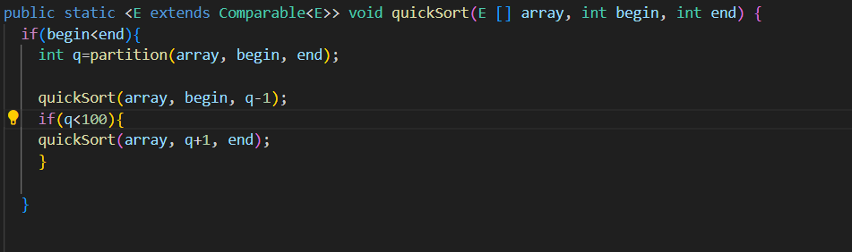

Project of the study
  1.hash function: h(k,i)=(f(k)+i)mod m,f(k)=k mod m

  2.The data to be tested is large, which may cause overflow during the process of quick sorting. Therefore, I restrict the quicksort condition to reduce the depth of recursive calls. The following picture is my quicksort changes.
  
  

  3.I think the stack overflow problem was my only mistake, the stack consignment far exceeded the allowed depth, so I had to set the condition q less than 100 to fix the problem

  4.I think my time complexity is good. I use Quicksort and the time complexity is O (n * log (n)).

  5.I thought it was very difficult to solve the stack overflow problem, and I thought a lot about it, and finally I had to set conditions.

  6.Through this programming, I have a deeper understanding of binary search trees and hash tables. And deepen the understanding of the interface.